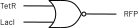
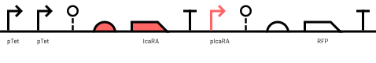

Emergence is a language for writing genetic circuits. The program is written in the form of logic functions, which describe boolean logic between variables and produce an output. These functions together form an abstract logic circuit which is then converted to a genetic circuit that consists of genetic gates.

## Program

Emergence program can consist of 2 entities: **Functions** or **Genes**.

**Functions** describe logic operations between variables and produce output. Variables can be replaced by any value, which is assigned by the compiler.

```rust
fn not a -> b {
    b = ~a;
}
```

Functions can use boolean operation or they can call other functions:
```rust
fn nor(a, b) -> c {
    let orab = a | b;
    c = not(orab);
}
```

**Genes** on the other hand take **values** as inputs, and they can be proteins or signaling molecules. You can think of them as events. When **x** signal or protein concentration changes, the output protein **y** concentration changes respectively.

```rust
// the red fluorescent protein is synthesized when there is a low concentration of lactose
gene blue LacI -> RFP {
    RFP = not(LacI);
}
```

## Assigner

After parsing a program into a parse tree, the compiler creates an abstract logic circuit. E.g.

```rust
gene main (TetR, LacI) -> RFP {
	RFP = TetR ~| LacI;
}
```
compiles to:



which then gets converted to genetic gates by the Assigner:



Assigner is using the KdTree search algorithm to find genetic gates with the most similar response functions. Response function describes the expression of a protein, based on the concentration of inputs. There are two modes: normal and strict. Normal mode is optimized for assigning more gates, but with the possibility that these gates are not the best solution. Strict mode will always assign the best gates, but with a change of failing to assign all of them if circuits are big.
